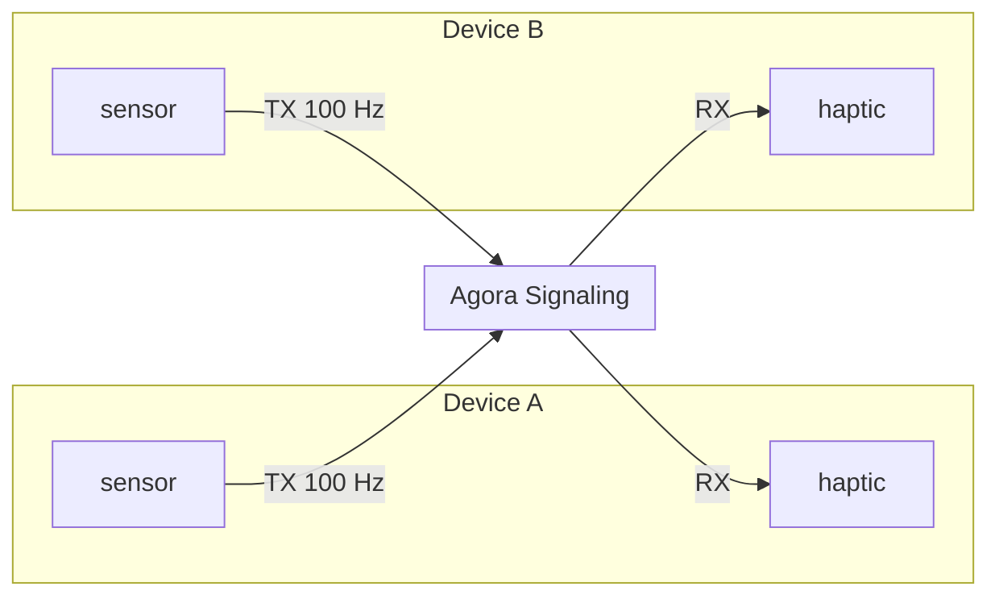
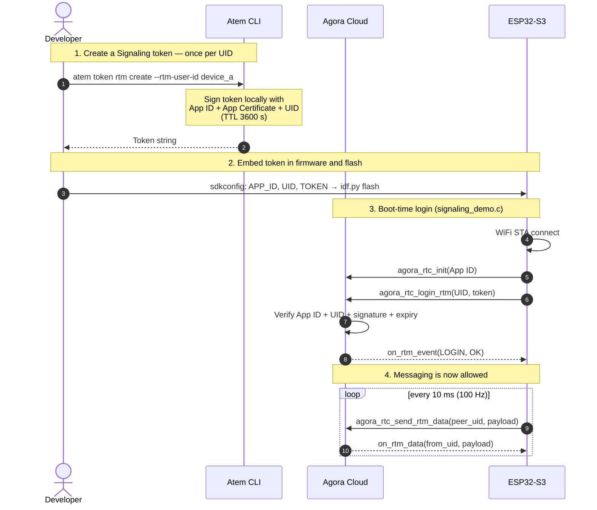

# HapticHatch

ESP32-S3 firmware demonstrating **high-frequency, high-resolution** data streaming between two devices over [Agora Signaling](https://docs.agora.io/en/signaling/overview/product-overview) at **100 Hz** — pushing the limits of low-latency peer-to-peer messaging on embedded hardware.



## Hardware

| Item | Details |
|------|---------|
| SoC  | ESP32-S3 with 8 MB embedded OPI PSRAM |
| Flash | 8 MB |

## Prerequisites

- [ESP-IDF v5.2.x](https://docs.espressif.com/projects/esp-idf/en/v5.2.3/esp32s3/get-started/)
- [AOSL](https://github.com/AgoraIO-Community/aosl) source tree checked out at `../aosl` (sibling of this repo)
- [Agora Account](https://console.agora.io) with Signaling enabled
- [Atem](https://github.com/Agora-Build/Atem) CLI for token generation

## Repository layout

```
HapticHatch/
├── components/
│   ├── aosl/            # ESP-IDF wrapper for the AOSL source tree
│   ├── haptic/          # Haptic driver (stub: logs intensity)
│   ├── rtsa_transport/  # Agora RTSA SDK transport + link glue
│   └── sensor/          # Sensor driver (stub: sine wave at 100 Hz)
├── main/
│   ├── main.c           # app_main: wires sensor → haptic, starts Signaling demo
│   ├── signaling_demo.c       # WiFi init, Signaling login, 100 Hz TX task, RX callback
│   └── signaling_demo.h
├── partitions.csv        # 3 MB factory partition (required by SDK size)
└── sdkconfig.defaults    # Target, flash, PSRAM, and credential defaults
```

## Configuration

Copy `sdkconfig.defaults` and fill in your credentials before building.

```ini
# sdkconfig.defaults

CONFIG_AGORA_APP_ID="<your-agora-app-id>"
CONFIG_AGORA_SIGNALING_TOKEN="<signaling-token-for-this-device>"
CONFIG_AGORA_SIGNALING_LOCAL_UID="device_a"   # identity of this device
CONFIG_AGORA_SIGNALING_REMOTE_UID="device_b"  # peer to send to / receive from
CONFIG_DEMO_WIFI_SSID="<your-ssid>"
CONFIG_DEMO_WIFI_PASSWORD="<your-password>"
```

### Generate Signaling tokens with `atem`

Signaling tokens expire after **3600 s**. Regenerate before each flash session:

```bash
atem token rtm create --rtm-user-id device_a   # for the first device
atem token rtm create --rtm-user-id device_b   # for the second device
```

Paste each token into the matching `sdkconfig.defaults` before building.

### How tokens and login work

Each UID (`device_a`, `device_b`) needs its own token. The token is signed by Agora's backend using your App ID's secret and binds to `{App ID, UID, expiry}`. The device presents the token to Agora at boot time; only after login succeeds can it send or receive messages.



**Common login failures**:
- Token expired (TTL 3600 s) → regenerate with `atem`
- UID in `CONFIG_AGORA_SIGNALING_LOCAL_UID` doesn't match the UID the token was issued for
- App ID mismatch between the token and `CONFIG_AGORA_APP_ID`

## Building

```bash
# 1. Activate ESP-IDF
source /path/to/esp-idf/export.sh

# 2. Remove stale config (required whenever sdkconfig.defaults changes)
rm -f sdkconfig

# 3. Build
idf.py build
```

## Running two devices

### Flash device A (`/dev/ttyUSB0`)

Set `sdkconfig.defaults`:
```ini
CONFIG_AGORA_SIGNALING_LOCAL_UID="device_a"
CONFIG_AGORA_SIGNALING_REMOTE_UID="device_b"
CONFIG_AGORA_SIGNALING_TOKEN="<device_a token>"
```

```bash
rm sdkconfig && idf.py -p /dev/ttyUSB0 build flash
```

### Flash device B (`/dev/ttyUSB1`)

Update `sdkconfig.defaults`:
```ini
CONFIG_AGORA_SIGNALING_LOCAL_UID="device_b"
CONFIG_AGORA_SIGNALING_REMOTE_UID="device_a"
CONFIG_AGORA_SIGNALING_TOKEN="<device_b token>"
```

```bash
rm sdkconfig && idf.py -p /dev/ttyUSB1 build flash
```

### Monitor both simultaneously

```bash
# terminal 1
idf.py -p /dev/ttyUSB0 monitor

# terminal 2
idf.py -p /dev/ttyUSB1 monitor
```

### Expected output

**device_a** (transmitting to device_b, receiving from device_b):
```
I (...) signaling: Signaling login success uid=device_a
I (...) signaling: Starting 100 Hz Signaling sender
I (...) signaling: TX seq=1    ts=5080 ms  force=0.57
I (...) signaling: TX seq=2    ts=5090 ms  force=0.59
...
I (...) signaling: RX from=device_b seq=1  ts=5150 ms  force=0.42
```

Messages flow in both directions at **100 Hz**.

## Troubleshooting

| Symptom | Cause | Fix |
|---------|-------|-----|
| `aosl_malloc N byte failed` on boot | PSRAM not enabled | Verify `CONFIG_SPIRAM=y` in sdkconfig.defaults, do `rm sdkconfig` before rebuild |
| `Signaling login failed err=101` | Token expired or wrong UID | Regenerate token with `atem`, `rm sdkconfig`, rebuild |
| `TX result state=2` warnings | Peer not yet online | Normal until both devices are logged in |
| `idf.py: command not found` | IDF env not sourced | `source /path/to/esp-idf/export.sh` |
| Build fails: `AOSL_LOG_ERR undeclared` | Outdated AOSL tree (pre-fix) | Update AOSL: `cd ../aosl && git pull` (fix is in AgoraIO-Community/aosl#3) |
